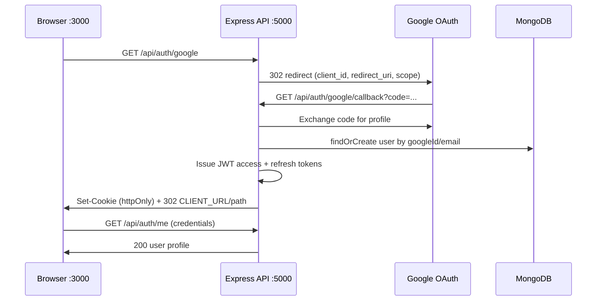

# OAuth Discovery — MR5 School

## Authentication architecture



## Provider inventory

| Provider | Status | Implementation |
|----------|--------|----------------|
| Google OAuth 2.0 | **Active** | `passport-google-oauth20` |
| GitHub / Facebook / Apple | Not implemented | — |
| NextAuth / Auth.js | Not used | — |
| Clerk / Supabase / Firebase Auth | Not used | — |
| Email/password | Active | JWT + refresh tokens |

## Redirect flow map

1. User clicks Google on `http://localhost:3000/login`
2. Browser navigates to `http://localhost:5000/api/auth/google`
3. Passport redirects to `accounts.google.com` with:
   - `redirect_uri=http://localhost:5000/api/auth/google/callback`
   - `scope=profile email`
4. Google returns to API callback
5. API sets `access_token` + `refresh_token` cookies on **API origin**
6. API redirects to `CLIENT_URL` + role path (`/dashboard`, `/student/portal`, `/onboarding`, `/admin`)

## Session lifecycle

| Stage | Mechanism |
|-------|-----------|
| Login (password) | `POST /api/auth/login` → httpOnly cookies |
| Login (Google) | OAuth callback → httpOnly cookies |
| Session read | `GET /api/auth/me` (cookie or Bearer) |
| Refresh | `POST /api/auth/refresh` (refresh cookie, rotation) |
| Logout | `POST /api/auth/logout` (revoke + clear cookies) |

## Token lifecycle

| Token | Storage | TTL | Transport |
|-------|---------|-----|-----------|
| Access JWT | `access_token` cookie | 15m | httpOnly, SameSite=Lax |
| Refresh | `refresh_token` cookie + DB | 7d | httpOnly, rotated on use |

## Security boundaries

- `GOOGLE_CLIENT_SECRET` — API only (never `NEXT_PUBLIC_*`)
- Frontend calls API with `withCredentials: true`
- CORS: `credentials: true`, origin allowlist includes `http://localhost:3000`
- Post-auth redirects are **path-only** (no open redirect to external hosts)

## Environment dependency graph

```
GOOGLE_CLIENT_ID ──┐
GOOGLE_CLIENT_SECRET ──┼── passport GoogleStrategy
GOOGLE_CALLBACK_URL ──┘         │
PORT ───────────────────────────┼── must match callback port
CLIENT_URL ─────────────────────┼── post-OAuth browser redirect
CORS_ORIGIN ────────────────────┘── browser origin allowlist
NEXT_PUBLIC_API_URL ────────────── frontend → API base (must match PORT)
JWT_SECRET ─────────────────────── access/refresh signing
```

## Key files

| Area | Path |
|------|------|
| Strategy | `Mr5-School-API-main/src/config/passport.js` |
| Routes | `Mr5-School-API-main/src/routes/authRoutes.js` |
| Controller | `Mr5-School-API-main/src/controllers/authController.js` |
| Middleware | `Mr5-School-API-main/src/middleware/authMiddleware.js` |
| Env | `Mr5-School-API-main/src/config/env.js` |
| Frontend button | `client-main/components/auth/GoogleSignInButton.tsx` |
| API base | `client-main/lib/api-base.ts` |
| Axios | `client-main/lib/apiClient.ts` |
